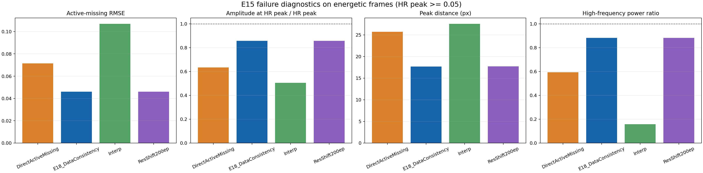
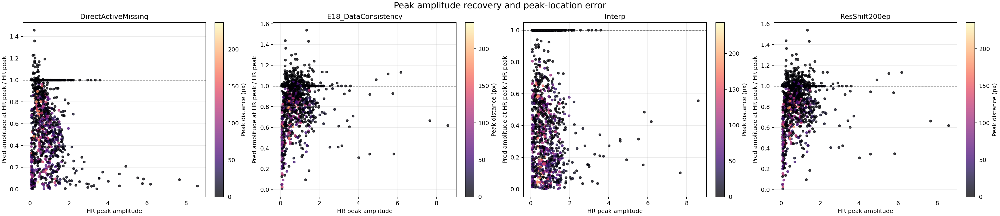
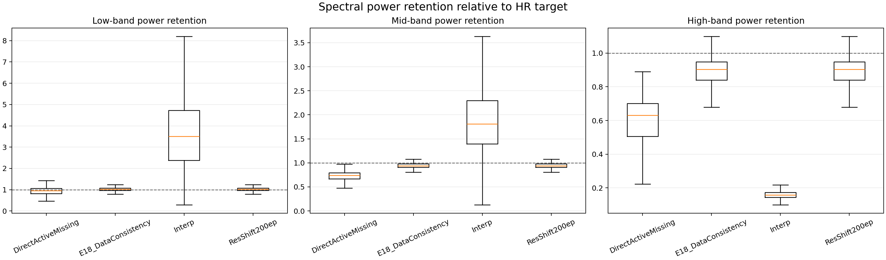
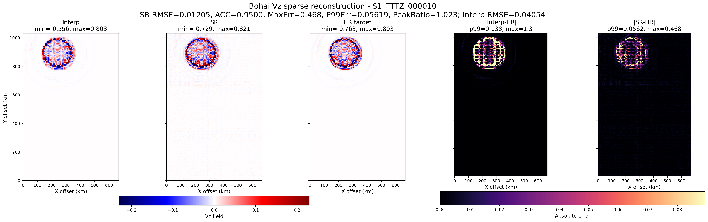
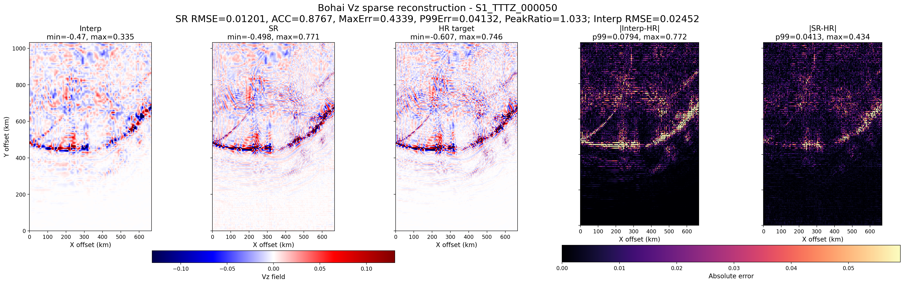
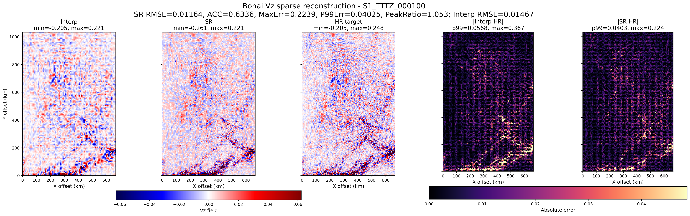

# Bohai Vz Sparse-Mask 2x Reconstruction Results

This folder contains a lightweight, Git-trackable snapshot of the Bohai Vz sparse reconstruction experiments. Large artifacts are intentionally excluded from Git, including model checkpoints, `.npy` predictions, local logs, and full `testouts/` directories.

## Task

The current task is fixed-grid sparse wavefield reconstruction, not geometric image upsampling:

```text
Input per frame: Vz_sparse, Vz_interp, mask_observed
Temporal input: t-2, t-1, t, t+1, t+2
Target: full-resolution Vz(t)
Grid: 200 x 150
Observed ratio: 25%
Missing ratio: 75%
```

The model predicts the complete `Vz` field on the same `200 x 150` grid. Observed sparse points are hard-constrained to the input values during final prediction.

## Main Result

The strongest result so far is:

```text
Model: ResShift200ep
Local output directory:
/data1/user/lz/wave_movie/testouts/Resshift_SparseMask2xObserved_Vz_MSEAux_200ep

Local best checkpoint:
/data1/user/lz/wave_movie/testouts/Resshift_SparseMask2xObserved_Vz_MSEAux_200ep/best_model.pth

Local full predictions:
/data1/user/lz/wave_movie/testouts/Resshift_SparseMask2xObserved_Vz_MSEAux_200ep/predictions
```

The checkpoint and prediction arrays are not committed because they are large generated artifacts.

## Overall Metrics

From `Resshift_50ep_vs_200ep_eval/model_summary_vz.csv`:

| Method | RMSE | MAE | RFNE | ACC | SSIM | Peak Ratio | RMSE Reduction vs Interp |
|---|---:|---:|---:|---:|---:|---:|---:|
| Interp | 0.037303 | 0.010568 | 1.053080 | 0.301673 | 0.738434 | 0.853189 | baseline |
| ResShift50ep | 0.019421 | 0.007876 | 0.548255 | 0.841752 | 0.825474 | 0.940358 | 47.94% |
| ResShift200ep | 0.015829 | 0.006835 | 0.446843 | 0.897084 | 0.856351 | 0.971896 | 57.57% |

Failure-diagnostic summary:

| Method | RMSE | Missing RMSE | Active-Missing RMSE | Active-Missing ACC | Target Peak Ratio | High-Power Ratio |
|---|---:|---:|---:|---:|---:|---:|
| DirectActiveMissing | 0.021125 | 0.024393 | 0.071497 | 0.616672 | 0.634177 | 0.592702 |
| ResShift200ep | 0.015087 | 0.017420 | 0.046115 | 0.806288 | 0.856433 | 0.882172 |
| E18 DataConsistency | 0.015088 | 0.017422 | 0.046152 | 0.806269 | 0.856401 | 0.882249 |

Conclusion: `ResShift200ep` is still the current main result. `E18 DataConsistency` is a controlled negative result: adding hard data-consistency projection at each ResShift sampling step did not materially improve reconstruction.

## Included Figures

Representative ResShift200ep every-10-frame visualizations for case `S1_TTTZ`:

```text
docs/results/bohai-vz-sparsemask-2x/resshift200ep_every10/
```

E18 comparison figures and metrics:

```text
docs/results/bohai-vz-sparsemask-2x/e18_data_consistency/
```

Failure diagnostics:

```text
docs/results/bohai-vz-sparsemask-2x/diagnostics/
```

Key diagnostic figures:







Example ResShift200ep frames:







## Experiment Interpretation

Current models are not simply failing to learn. They reduce global and active-missing error substantially versus interpolation. The remaining problem is harder: high-energy missing wavefront regions still lose local structure, phase, and peak fidelity in difficult frames.

The main negative findings are:

- Adding simple spatial high-frequency / Laplacian loss did not reliably improve structure.
- Adding sequence-output temporal supervision did not beat the best direct ResShift result.
- Adding per-step hard data consistency did not improve the already constrained ResShift output.
- Peak-preserving post-refinement can raise peak ratio, but can also worsen RMSE and create incorrect structure if the constraint is too strong.

The next useful direction is not to keep tuning data-consistency strength. A more promising direction is to add physical/propagation context, such as source/time conditioning, larger spatial context, or active-wavefront-specific structural supervision.

